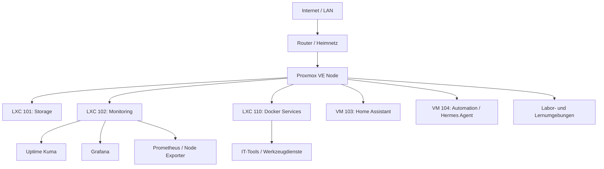

# Homelab Portfolio

> Dokumentation meines privaten Homelabs mit Fokus auf Proxmox, Linux-Administration, LXC, Docker, Monitoring, Storage, Automation und sauberer Betriebsdokumentation.

## Überblick

Dieses Repository dokumentiert mein persönliches Homelab als praxisnahes IT-Portfolio. Ziel ist es, typische Aufgaben aus Systemadministration und Fachinformatik Systemintegration nachvollziehbar zu zeigen: Virtualisierung, Dienste trennen, Monitoring aufbauen, Storage strukturieren, Backups planen, Automatisierung einsetzen und Änderungen sauber dokumentieren.

Das Homelab ist bewusst als Lern- und Laborumgebung aufgebaut. Die Dokumentation zeigt nicht nur, welche Dienste laufen, sondern auch, warum sie getrennt wurden und welche administrativen Fähigkeiten dabei trainiert werden.

## Schwerpunkte

- Virtualisierung mit Proxmox VE
- Linux-Server und LXC-Container
- Docker Engine und Docker Compose
- Monitoring mit Uptime Kuma, Grafana, Prometheus und Node Exporter
- Storage- und Backup-Konzept
- Smart-Home-Integration mit Home Assistant
- Automatisierung mit Hermes Agent
- Dokumentation, Troubleshooting und Betriebsprozesse
- Sicherheitsbewusstsein: keine Secrets im Repository, Rollen- und Diensttrennung

## Hardware

### Proxmox-Server

| Komponente | Details |
|---|---|
| Plattform | Eigenbau-/Desktop-System auf MSI MAG B550 TOMAHAWK |
| Mainboard | Micro-Star International MAG B550 TOMAHAWK (MS-7C91) |
| CPU | AMD Ryzen 7 5800X, 8 Kerne / 16 Threads |
| RAM | 32 GB |
| Systemdisk | 447 GB SSD, Patriot Burst |
| Datenspeicher | 1,8 TB SSD, WDC WDS200T2B0A |
| Virtualisierung | Proxmox VE 9.1.9, Bare-Metal |
| Storage-Pools | `local`, `local-lvm`, separater Datenspeicher `daten` |

Der Host ist bewusst als leistungsfähige lokale Virtualisierungsplattform aufgebaut. Die Trennung zwischen Systemdisk und separatem Datenspeicher erleichtert die Organisation von VMs, LXC-Containern, Backups und Exporten.

## Architektur

## Systeme und Rollen

| System | Rolle | Beschreibung |
|---|---|---|
| Proxmox VE | Virtualisierung | Basis für VMs und LXC-Container |
| LXC 101 | Storage | Datenablage, SMB/CIFS, Backup-Ziel |
| LXC 102 | Monitoring | Uptime Kuma, Grafana, Prometheus und Node Exporter |
| LXC 110 | Docker Services | Separater Container für Docker-/Werkzeugdienste |
| VM 103 | Smart Home | Home Assistant |
| VM 104 | Automation | Hermes Agent, Telegram Gateway, Automatisierung |
| Lab-Umgebungen | Lernumgebung | Isolierte Windows-/Linux-Laborumgebungen |

Private IP-Adressen, Tokens, MAC-Adressen und sensible Details werden bewusst nicht öffentlich dokumentiert.

## Aktuelle Dienste

| Dienst | Rolle | System |
|---|---|---|
| Uptime Kuma | Verfügbarkeitsmonitoring | LXC 102 `monitoring` |
| Grafana | Dashboards / Metriken | LXC 102 `monitoring` |
| Prometheus | Metriksammlung | LXC 102 `monitoring` |
| Node Exporter | Linux-Systemmetriken | LXC 102 `monitoring`, LXC 110 `docker-services` |
| Docker Engine | Containerplattform | LXC 110 `docker-services` |
| IT-Tools | Referenz-/Werkzeugdienst | LXC 110 `docker-services` |
| Home Assistant | Smart-Home-Verwaltung | VM 103 |
| Hermes Agent | Automatisierung / Assistenzsystem | VM 104 |

## Was dieses Homelab zeigt

### Infrastruktur planen

Die Dienste sind rollenbasiert getrennt. Storage, Monitoring, allgemeine Docker-Dienste und Automation laufen nicht ungeordnet in einem einzigen Container, sondern jeweils in klar definierten Systemen.

### Monitoring betreiben

Uptime Kuma übernimmt Verfügbarkeitschecks. Prometheus sammelt erste Systemmetriken über Node Exporter. Grafana dient als Dashboard-Schicht und visualisiert diese Metriken.

### Containerisierung nutzen

Allgemeine Tools und Werkzeugdienste laufen in einem eigenen Docker-Services-LXC. Dadurch bleiben Monitoring und produktionsnahe Services sauber getrennt.

### Dokumentation pflegen

Jede Rolle wird in eigenen Markdown-Dateien beschrieben. Das Repository soll nachvollziehbar zeigen, wie die Umgebung aufgebaut ist, welche Entscheidungen getroffen wurden und wie sie weiterentwickelt werden kann.

## Dokumentation

- [Hardware](docs/hardware.md)
- [Architektur](docs/architecture.md)
- [Netzwerk](docs/network.md)
- [Services](docs/services.md)
- [Storage](docs/storage.md)
- [Monitoring](docs/monitoring.md)
- [Backup-Strategie](docs/backup-strategy.md)
- [Security](docs/security.md)
- [Automation](docs/automation.md)
- [Troubleshooting](docs/troubleshooting.md)
- [Zielzustand Proxmox](docs/proxmox-target-state.md)
- [Roadmap](docs/roadmap.md)

## Security- und Datenschutzgrundsätze

- keine Passwörter, Tokens oder API-Keys im Repository
- keine MAC-Adressen oder sensiblen Hostdetails
- öffentliche Dokumentation nutzt Rollen statt privater Detaildaten
- bereinigte Referenzkonfigurationen werden als `.example` dokumentiert
- Dienste werden intern betrieben, keine öffentlichen Portfreigaben im Rahmen dieses Repos

## Roadmap

- [x] Rollenmodell für Storage, Monitoring, Docker Services und Automation festlegen
- [x] Grafana im Monitoring-LXC ergänzen
- [x] Separaten Docker-Services-LXC erstellen
- [x] erster produktiver interner Werkzeugdienst über Docker Compose bereitstellen
- [x] Prometheus und Exporter sauber ergänzen
- [x] Grafana-Dashboard exportieren und dokumentieren
- [ ] Backup-Prozess praktisch validieren und dokumentieren
- [ ] Netzwerkdiagramm als Draw.io-Datei ergänzen
- [ ] anonymisierte Screenshots anonymisiert hinzufügen
- [ ] GitHub Actions für Markdown-Prüfung ergänzen

## Hinweis

Dieses Repository beschreibt eine private Lern- und Laborumgebung. Es erhebt keinen Anspruch auf produktionsreife Enterprise-Architektur, sondern zeigt praxisnahes Lernen, saubere Dokumentation und den strukturierten Aufbau administrativer Fähigkeiten.
