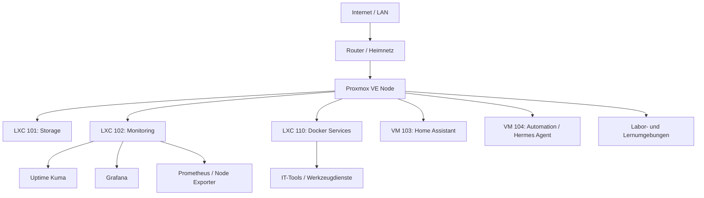

# Homelab Portfolio

> Mein privates Homelab auf Basis von Proxmox VE. Hier dokumentiere ich, wie ich Linux-Systeme, LXC-Container, Docker-Dienste, Monitoring und Storage zuhause betreibe.

## Überblick

Ich betreibe zuhause einen Proxmox-Server und nutze ihn als Lernumgebung für Systemadministration.

Daran übe ich FISI-Themen praktisch: Linux-Server betreiben, Dienste trennen, Docker einsetzen, Monitoring aufbauen, Konfigurationen sichern und Fehler systematisch eingrenzen.

Vieles davon habe ich aufgebaut, getestet, wieder angepasst und anschließend dokumentiert. Das Repository soll deshalb nicht nur eine Diensteliste sein, sondern auch zeigen, wie ich Entscheidungen und offene Punkte festhalte.

## Schwerpunkte

- Virtualisierung mit Proxmox VE
- Linux-Server und LXC-Container
- Docker Engine und Docker Compose
- Monitoring mit Uptime Kuma, Grafana, Prometheus und Node Exporter
- Storage über SMB/CIFS
- Backup-Planung mit ehrlicher Beschreibung des aktuellen Stands
- Smart-Home-Integration mit Home Assistant
- Automatisierung und kleine Admin-Skripte
- Troubleshooting und Betriebsnotizen
- Security-Grundsätze für ein öffentliches Repository

## Hardware

### Proxmox-Server

| Komponente | Details |
|---|---|
| Plattform | Eigenbau-/Desktop-System auf MSI MAG B550 TOMAHAWK |
| Mainboard | Micro-Star International MAG B550 TOMAHAWK (MS-7C91) |
| CPU | AMD Ryzen 7 5800X, 8 Kerne / 16 Threads |
| RAM | 32 GB |
| Systemdisk | 447 GB SSD, Patriot Burst |
| Datenspeicher | 1,8 TB SSD, WDC WDS200T2B0A |
| Virtualisierung | Proxmox VE 9.1.9, Bare-Metal |
| Storage-Pools | `local`, `local-lvm`, separater Datenspeicher `daten` |

Der Host ist meine zentrale Virtualisierungsplattform. Systemdisk und Datenspeicher sind getrennt, damit VMs, LXC-Container, Exporte und lokale Daten nicht komplett vermischt werden.

## Architektur

## Systeme und Rollen

| System | Rolle | Beschreibung |
|---|---|---|
| Proxmox VE | Virtualisierung | Basis für VMs und LXC-Container |
| LXC 101 | Storage | Datenablage, SMB/CIFS und interne Exporte |
| LXC 102 | Monitoring | Uptime Kuma, Grafana, Prometheus und Node Exporter |
| LXC 110 | Docker Services | Separater Container für Docker- und Werkzeugdienste |
| VM 103 | Smart Home | Home Assistant |
| VM 104 | Automation | Hermes Agent, Telegram Gateway und Automatisierung |
| Lab-Umgebungen | Lernumgebung | Isolierte Windows- und Linux-Laborsysteme |

Private IP-Adressen, Tokens, MAC-Adressen und sensible Details stehen nicht im öffentlichen Repository.

## Aktuelle Dienste

| Dienst | Rolle | System |
|---|---|---|
| Uptime Kuma | Verfügbarkeitsmonitoring | LXC 102 `monitoring` |
| Grafana | Dashboards und Metriken | LXC 102 `monitoring` |
| Prometheus | Metriksammlung | LXC 102 `monitoring` |
| Node Exporter | Linux-Systemmetriken | LXC 102 `monitoring`, LXC 110 `docker-services` |
| Docker Engine | Containerplattform | LXC 110 `docker-services` |
| IT-Tools | interner Werkzeugdienst | LXC 110 `docker-services` |
| Home Assistant | Smart-Home-Verwaltung | VM 103 |
| Hermes Agent | Automatisierung und Dokumentation | VM 104 |

## Was ich damit übe

### Systeme planen und trennen

Monitoring, Storage, Docker-Dienste und Automation laufen nicht in einem großen Mischsystem. Jede Rolle hat ein eigenes Ziel. Das macht Updates, Fehlersuche und spätere Änderungen einfacher.

### Monitoring betreiben

Uptime Kuma prüft, ob Dienste erreichbar sind. Prometheus sammelt Metriken über Node Exporter. Grafana bereitet diese Werte als Dashboard auf.

### Docker sinnvoll einsetzen

Allgemeine Tools laufen im separaten Docker-Services-LXC. Dadurch bleibt das Monitoring getrennt von normalen Werkzeugdiensten.

### Dokumentation pflegen

Jede wichtige Rolle hat eine eigene Markdown-Datei. So kann ich später sehen, warum ein Dienst wo läuft und welche Punkte noch offen sind.

## Dokumentation

- [Hardware](docs/hardware.md)
- [Architektur](docs/architecture.md)
- [Netzwerk](docs/network.md)
- [Services](docs/services.md)
- [Storage](docs/storage.md)
- [Monitoring](docs/monitoring.md)
- [Backup-Strategie](docs/backup-strategy.md)
- [Security](docs/security.md)
- [Automation](docs/automation.md)
- [Troubleshooting](docs/troubleshooting.md)
- [Zielzustand Proxmox](docs/proxmox-target-state.md)
- [Roadmap](docs/roadmap.md)

## Aktueller Stand und Grenzen

Das Homelab ist im Aufbau. Monitoring, Docker-Services, Storage und Automation sind getrennt beschrieben.

Beim Thema Backup bin ich noch nicht am Ziel: Es gibt aktuell kein unabhängiges zweites Backup-Medium. Snapshots und lokale Sicherungen verkaufe ich deshalb nicht als vollständiges Backup-Konzept. Ein separates Backup-Ziel ist als nächster Ausbauschritt geplant.

## Security- und Datenschutzgrundsätze

- keine Passwörter, Tokens oder API-Keys im Repository
- keine MAC-Adressen oder sensiblen Hostdetails
- öffentliche Dokumentation nutzt Rollen statt privater Detaildaten
- Referenzkonfigurationen werden als `.example` abgelegt
- Dienste werden intern betrieben
- keine öffentlichen Portfreigaben im Rahmen dieses Repositories

## Roadmap

- [x] Rollenmodell für Storage, Monitoring, Docker Services und Automation festlegen
- [x] Grafana im Monitoring-LXC ergänzen
- [x] separaten Docker-Services-LXC erstellen
- [x] ersten internen Werkzeugdienst über Docker Compose bereitstellen
- [x] Prometheus und Exporter ergänzen
- [x] Grafana-Dashboard exportieren und dokumentieren
- [ ] Backup-Prozess mit Test-Restore prüfen
- [ ] separates Backup-Ziel einplanen
- [ ] Netzwerkdiagramm als Draw.io-Datei ergänzen
- [ ] anonymisierte Screenshots hinzufügen
- [ ] GitHub Actions für Markdown-Prüfung ergänzen

## Hinweis

Das ist kein Firmennetz und keine produktive Umgebung. Ich nutze das Homelab, um reale Admin-Aufgaben zu üben und meine Arbeit verständlich zu dokumentieren.
